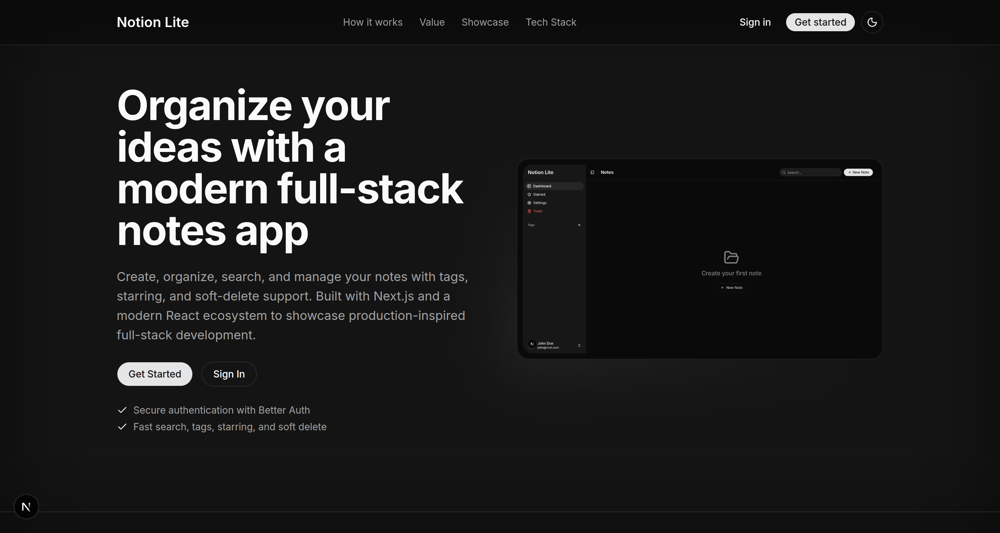
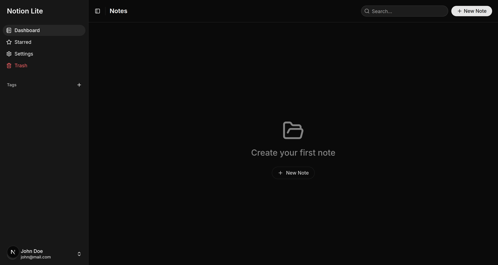
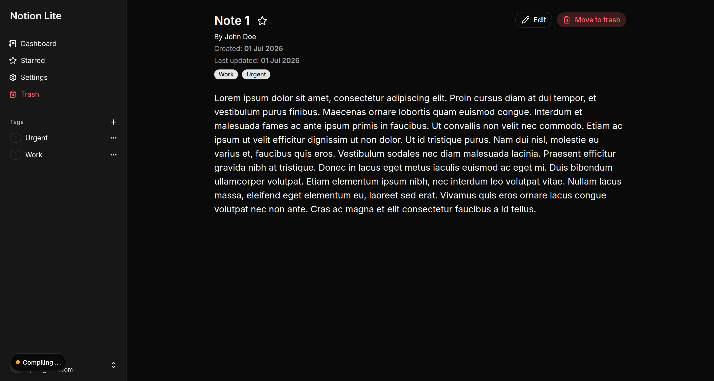
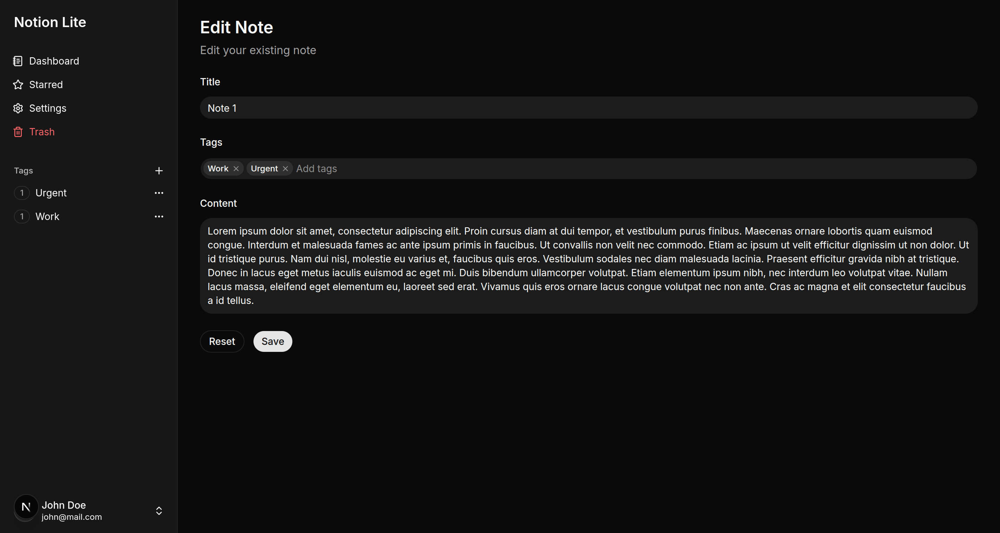
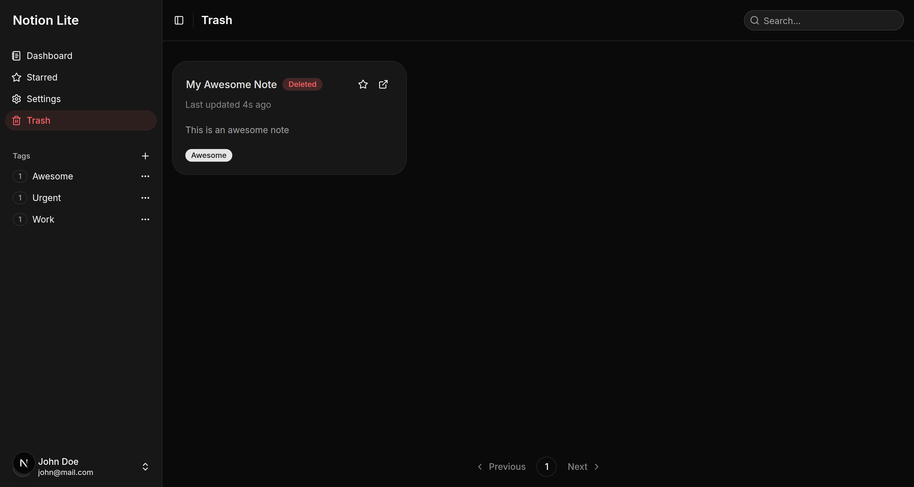
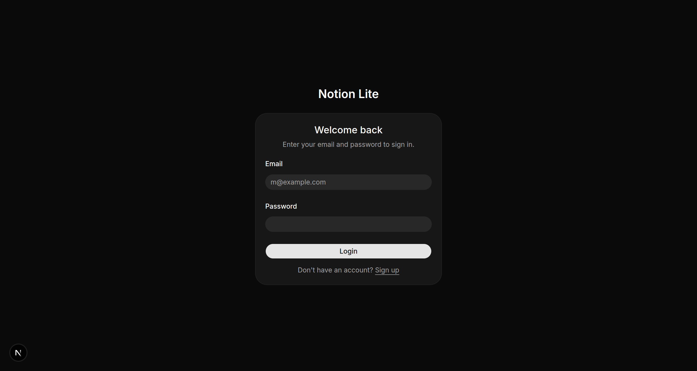

# Notion Lite - Full-Stack Modern Notes Management System

A production-inspired full-stack notes application built with the modern Next.js ecosystem.
It demonstrates authentication, relational data modeling, optimistic UI, caching strategies, and scalable React architecture.

---

## 📑 Table of Contents

- [Live Demo](#live-demo)
- [Screenshots](#screenshots)
- [Features](#features)
- [Tech Stack](#tech-stack)
- [Architecture](#architecture-overview)
- [Key Features Implementation](#key-features-implementation)
- [What This Project Demonstrates](#what-this-project-demonstrates)
- [Run Locally](#run-locally)
- [Key Engineering Decisions](#key-engineering-decisions)
- [Future Improvements](#future-improvements)
- [Author](#author)
- [License](#license)

---

## Live Demo

> [https://notion-lite-notes.vercel.app/](https://notion-lite-notes.vercel.app/)

---

## Screenshots

<p align='center'>
  
  
  
</p>

<p align="center">
  
  
  
</p>

---

## Features

### Authentication & Security

- Secure authentication powered by **Better Auth**
- Better Auth session management with cookie caching
- Email/password authentication
- GitHub social login
- One-click demo user login
- Protected routes and session handling
- Clean login / signup flow with error states and toasts notifications

---

### Notes Management

- Create, update, delete (soft delete + permanent delete)
- Rich text note editing with **Tiptap**
- Star important notes
- View full note details
- Timestamped updates (updated-at sorting)

---

### Rich Text Editor

A feature-rich editing experience powered by Tiptap.

Supported formatting includes:

- Bold, italic, strikethrough, inline code
- Clear formatting
- Paragraphs
- Headings (H1–H6)
- Bullet lists
- Ordered lists
- Code blocks
- Blockquotes
- Horizontal rules
- Undo / Redo

---

### Tags System (Many-to-Many)

- Each note can have multiple tags
- Tags can be created on the fly
- Dedicated tag pages
- Sidebar tag counts with real-time updates

---

### Search & Navigation

- Debounced search
- URL-synced search and pagination state
- Fast filtering across notes
- Paginated results for scalability

---

### SEO

- Metadata configured for every page
- Dynamic page titles for note and tag pages using generateMetadata()
- Page-specific titles generated from database content for improved discoverability

---

### Smart UX Patterns

- Optimistic UI updates (e.g. starring notes instantly)
- Loading skeletons for perceived performance
- Toast notifications for all user actions (via Sonner)
- Confirmation dialogs for destructive actions

---

### UI & Architecture

- Light, dark, and system theme support
- Theme switcher in the settings page
- Fully reusable sidebar layout across authenticated pages
- Modular component design
- Consistent UI system using **shadcn/ui**
- Responsive grid-based layout for notes

---

## Tech Stack

### Frontend

- **Next.js (App Router)**
- **React**
- **Tailwind CSS**
- **shadcn/ui**
- **Tiptap**

### Backend / Data

- **PostgreSQL**
- **Drizzle ORM**
- **Server Actions (Next.js)**

### Authentication

- **Better Auth**
- **GitHub OAuth**

### State Management / Data Fetching

- **TanStack Query**
- React `cache()`

### Forms & Validation

- **React Hook Form**
- **Zod**

### UX Enhancements

- **Sonner (toasts)**
- **Optimistic UI updates**
- **Debounced search**

---

## Architecture Overview

The app follows a modern full-stack Next.js architecture:

- Server Components for data-heavy rendering
- Server Actions for mutations (create/update/delete)
- Client Components for interactive UI
- TanStack Query for caching and client-state synchronization
- Drizzle ORM for type-safe database queries
- React `cache()` for reusable server-side data fetching shared between pages and metadata generation
- Better Auth session cookie caching to reduce repeated session validation work

### Data Model

- `Notes`
- `Tags`
- `NoteTags` (many-to-many relationship)

---

## Key Features Implementation

### Optimistic Updates

Star/unstar actions update instantly in UI using `useOptimistic`, while syncing in the background.

---

### Soft Delete System

Notes are never immediately destroyed:

- Soft delete → moves to trash
- Restore → recover notes
- Permanent delete → final removal

---

### Search System

- Debounced input
- Query stored in URL params
- Server-side filtering with pagination

---

### Rich Text Editing

- The note editor is built with Tiptap, providing a modern editing experience while keeping the editor modular and easily extensible.

---

### Keyboard Shortcut Handling

- The application uses shadcn/ui's keyboard shortcut for toggling the sidebar.
- After integrating the Tiptap editor, this shortcut conflicted with common editor shortcuts such as **Ctrl/Cmd + B** for bold formatting. To resolve this, the sidebar now ignores keyboard events originating from `contenteditable` elements, allowing editor shortcuts to work as expected without triggering sidebar navigation.

---

### Dynamic SEO Metadata

- Pages such as note details and tag pages use Next.js generateMetadata() to generate dynamic page titles based on database content.
- Because these routes are protected, session validation is performed inside generateMetadata() before fetching the required data.

---

### Demo User Authentication

- A dedicated server action handles demo account sign-in.
- Instead of exposing demo credentials to the client, the server action reads them from environment variables and performs authentication server-side, ensuring the credentials remain private while allowing visitors to quickly explore the application.

---

### Shared Server Data Fetching

- Both page rendering and generateMetadata() require the same note or tag data.
- To avoid duplicating data-fetching logic, database queries were extracted into reusable server-side functions and wrapped with React's cache(), allowing both consumers to share the same implementation.

---

### Form System

- React Hook Form for performance
- Zod schemas for validation
- Reusable create/edit note form
- Tag creation directly inside form (no navigation needed)

---

## What This Project Demonstrates

This is not just a CRUD notes app.

It demonstrates:

- Real-world authentication flow
- Relational database modeling
- Rich text editing with Tiptap
- Scalable UI architecture
- Performance-aware state management and server-side caching
- SEO optimization using the Next.js Metadata API
- Reusable server-side data fetching with React cache()
- UX-focused engineering decisions
- Production-style folder structure
- Multiple authentication strategies (email/password, GitHub OAuth, demo account)
- Secure server-side handling of demo account credentials
- Resolving integration issues between third-party libraries (for example, keyboard shortcut conflicts between shadcn sidebar and tiptap editor)

---

## Run Locally

```bash
git clone https://github.com/ishantbh/notion-lite.git
cd notion-lite
bun install
```

### Environment Variables

```env
DATABASE_URL=
BETTER_AUTH_URL=
BETTER_AUTH_SECRET=
```

### Run Development Server

```bash
bun dev
```

---

## Key Engineering Decisions

- Server Actions were used instead of REST API routes to keep mutations colocated with the UI.
- TanStack Query is used selectively for client-side caching instead of managing every piece of state globally.
- Optimistic updates are implemented only where they provide meaningful UX improvements.
- Soft delete was chosen over hard delete to provide a safer user experience.
- A many-to-many tag system allows notes to scale naturally without data duplication.
- Shared server-side data-fetching functions wrapped with React's `cache()` eliminate duplicated fetching logic between page rendering and `generateMetadata()`.
- Protected routes also validate the user session inside `generateMetadata()` to ensure metadata generation follows the same authorization rules as page rendering.
- Tiptap provides a richer and more realistic note-editing experience while remaining modular and extensible.
- Demo account credentials are never exposed to the client. A dedicated server action reads them from environment variables and performs authentication server-side.
- Enabled Better Auth session cookie caching to reduce unnecessary session lookups while keeping authentication transparent to the application.

---

## Future Improvements

- Image uploads within notes
- Full-text search indexing
- Note sharing / collaboration
- Version history

---

## Author

**Ishant Bhurani**

- GitHub: [https://github.com/ishantbh](https://github.com/ishantbh)
- LinkedIn: [https://www.linkedin.com/in/ishant-bhurani/](https://www.linkedin.com/in/ishant-bhurani/)

---

## License

This project is for portfolio/demo purposes.

---
